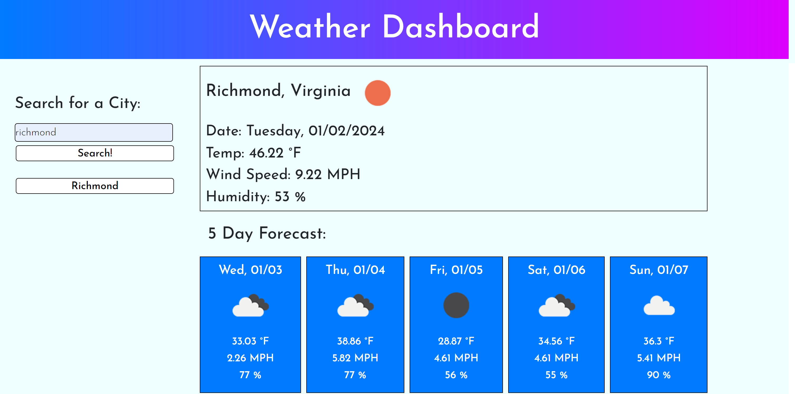

# JN-Weather-Dashboard

## Description

Through this challenge, I was able to create a weather dashboard. When the user enters a city name, they are presented with the current temperature, wind speed, and humidity of that city, as well as a 5-day forecast for that city. Once the user searches for a city, the cities that they searched will also save into the local storage, and they will be able to pull the weather data of the saved cities. The project was completed by following the acceptance criterias below:

```
GIVEN a weather dashboard with form inputs
WHEN I search for a city
THEN I am presented with current and future conditions for that city and that city is added to the search history
WHEN I view current weather conditions for that city
THEN I am presented with the city name, the date, an icon representation of weather conditions, the temperature, the humidity, and the wind speed
WHEN I view future weather conditions for that city
THEN I am presented with a 5-day forecast that displays the date, an icon representation of weather conditions, the temperature, the wind speed, and the humidity
WHEN I click on a city in the search history
THEN I am again presented with current and future conditions for that city
```

This challenge has helped me strengthen my skills in using third-party APIs. This was a particularly challenging code to write, but with the documentations as well as the tools provided during class, I was able to create the webpage. 


## Usage

There was no starter code provided for this challenge. The HTML, CSS, and JavaScript files were all created from scratch. I obtained an API key for the OpenWeather API, and with that key I was able to pull data for this webpage. The image below depicts the final webpage:




## Technologies Used

Bootstrap <br>
jQuery <br>
Day.js


## Credits

Thank you Corey Yates for always helping out! 😁


## Links

GitHub Repository: https://github.com/jkimys2/JN-Weather-Dashboard

Deployed Application: https://jkimys2.github.io/JN-Weather-Dashboard/